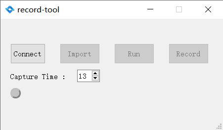

# record-tool

## Introduce

The `record-tool` is a simple raw data acquisition tool, only need to simply modify the parameters in the json file (such as high  && low power), and then import && execution, you can issue LiDAR, obtain pcap data file

## Use

1. Open the software `record-tool.exe`

2. Click `Connect` to connect the LiDAR, the status light on the connection will be displayed as `green`, the default is `gray`

3. Copy `config.json` in the directory of `record-tool.exe` to the desktop (directly modify the line), use the editor to open and edit the file, modify the corresponding parameters

4. Click the `Import` button to import `config.json` on the desktop

5. Click `Run` to issue the parameter command modified in Step 3. Low power and high power raw data files will be generated in the directory of `record-tool.exe`
